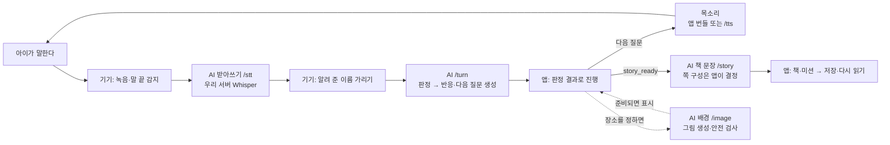

# 동화 모드 — AI가 들어가는 곳

확인일: 2026-10-02. 기준: `main 41ee6f0`을 포함한 `feature/minwoo`.
멘토 중간 공유용으로 현재 동화 구현을 요약했다. 일기·협업의 흐름이나 실제 기기 완주 결과를 나타내는 문서는 아니다.

## 한 장으로 보는 흐름

배경은 대화와 함께 진행한다. 그림을 만드는 동안 앱은 중립 화면으로 질문을 이어 간다. 주인공을 **말로 만들기**로 선택했을 때도 `/image`를 사용하며, `kind=character`로 요청한 PNG와 `rig`를 앱 화면에 넘긴다.

## AI와 앱의 역할

| 자리 | AI·서버가 하는 일 | 앱이 하는 일 | 담당 |
|---|---|---|---|
| 받아쓰기 `/stt` | 자체 GPU Whisper로 소리를 글자로 바꿈 | 마이크·말 끝 감지·녹음 중 마스코트 재생 방지 | 조장: 공통 음성·서버 |
| 대화 `/turn` | 판정과 마스코트 대사를 순서대로 생성 | 이름 가리기·복원, 출처를 구분해 칸 채우기, `next_slot`에 따른 질문과 `story_ready` 종료 | 조장: 서버·공통 입구 / 민우: 동화 흐름 |
| 그림 `/image` | 글자로 그림 지시 구성 → ComfyUI 생성 → 결과 안전 검사 | 배경·주인공 요청, 생성 결과 표시, 실패·시간 초과 시 기존 그림 사용 | 조장: 생성·검사 / 민우: 동화 연결 / 치영: 공통 그림·리그 표시 |
| 책 `/story` | 앱이 보낸 쪽 수·순서와 미션에 맞춰 문장을 채움 | 템플릿의 쪽·미션 목록 전송, 자막 복원·검증, 완료된 미션의 결과 문장 추가 | 조장: 서버 / 민우: 동화 책 연결 |
| 목소리 | 번들에 없는 대사를 `/tts`로 합성 | 보호자 이름 읽기 동의 적용, 일치하는 번들 소리는 기기에서 재생, 허용된 선택 구간에서 음성 중단 | 조장: 공통 음성 / 민우: 동화 선택 연결 |
| 책장 | 이 동화 저장 경로에서는 AI·서버를 부르지 않음 | 완성 자막·그림·창작 소리 참조를 기기에 저장하고 복원 | 민우: 동화 저장 / 공통 책장 화면: 담당자와 통합 |

앱에서 정하는 것: 템플릿과 쪽 순서, 미션 종류·완료, 수준 계산, 저장·재열기. LLM이 정하는 것: 아이 말의 판정 신호, 다음 질문 후보·종료 신호, 대사·책 문장·그림 지시. `story_ready`가 동화 종료 기준이며 고정 질문 횟수로 끝내지 않는다.

## 실패해도 이어지는 경로

- 받아쓰기 실패는 `Reply.Silent`로 들어간다. 판정·대사 실패와 같은 처리라고 묶지 않는다.
- `/turn`의 판정과 대사는 각각 실패할 수 있다. 받은 부분은 쓰고 빠진 부분은 동화의 대본 질문·반응으로 보완하며, 연결 실패에는 동화 재시도 경로가 있다.
- 그림 생성·검사 실패는 프리셋으로 이어진다. 검사되지 않은 생성 그림은 아이 화면에 표시하지 않는다.
- `/story`가 실패하거나 자막 수·내용이 맞지 않으면 템플릿 책을 사용한다. 따라서 책이 나왔다는 사실만으로 실제 AI 책 생성 성공이라고 판단하지 않는다.

## 개인정보와 검증 범위

- 대화 음성은 받아쓰기를 위해 **우리 서버**로 간다. 알려 준 이름은 기기에서 가린 뒤 `/turn`·`/story`·그림 지시에 사용한다. 처음 등장한 이름을 자동으로 모두 탐지한다는 뜻은 아니다.
- 창작 소리 녹음은 대화 받아쓰기와 별개다. 기기 안에서 녹음·재생·보관하며 외부 서버로 보내지 않는다.
- 화면·책에는 이름을 복원한다. 소리로 이름을 읽는 것은 보호자 동의 값에 따라 공통 `speakable()`이 처리한다.
- 자동 전체 검사 390개와 APK 빌드는 통과했다. 이 문서는 실제 폰의 마이크·스피커 및 운영 AI 한 권 완주를 대신하지 않는다. 상세 근거와 남은 기기 검증은 [민우 동화 V1 검증](민우_동화_V1_검증_1001.md)에 있다.

## 코드에서 확인할 곳

- 동화 질문·배경·주인공·책·선택: `demo/Scenes.kt`
- 판정 요청·이름 복원·칸 반영: `demo/StoryTurn.kt`
- 쪽 목록·미션 결과: `demo/StoryBook.kt`
- 기기 저장: `demo/StoryBookStore.kt` · `demo/StoryBookVisuals.kt`
- 공통 입력·목소리·선택 중단: `demo/Director.kt` · `net/Voice.kt` · `net/NameMask.kt`
- 네트워크 계약: `net/Server.kt` · `guidelines/3_API_명세.md`
- 서버 구현: `backend/app/routers/stt.py` · `turn.py` · `image.py` · `story.py` · `tts.py`

앱 경로의 앞부분은 `android/app/src/main/java/com/example/finalproject_demo/`다. 규칙·계약의 정본은 기존 `CLAUDE.md`와 `guidelines/`이며 이 문서에서 바꾸지 않는다.
