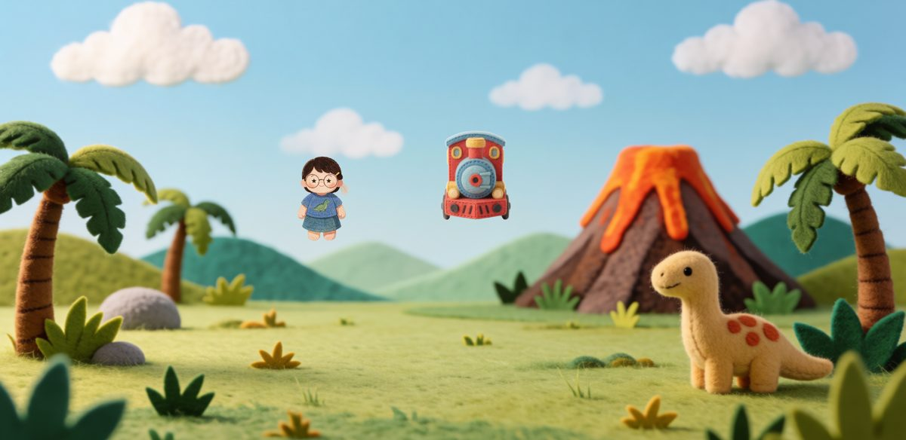
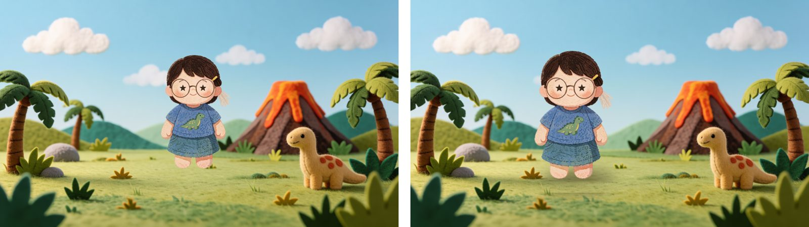
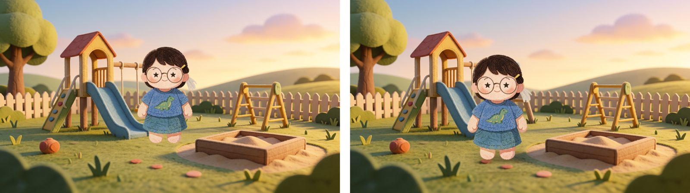
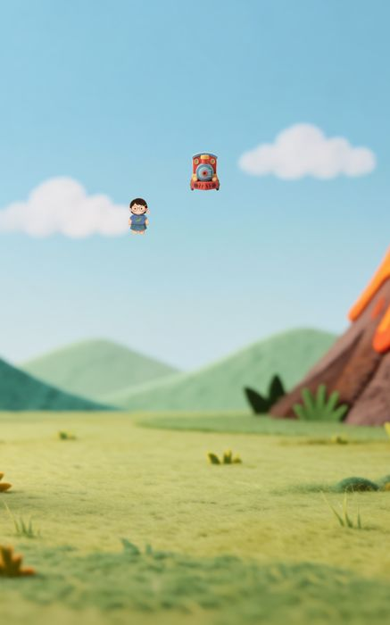

# 무대 배치 규칙 — 인물이 배경에 **서 있어** 보이게 (2026-09-23)

작성 이종훈 · 구현 **안치영** (`Scenes.kt` 좌표 · `Screen.kt` `WorldItemView` 둘 다 이 작업 동안 치영님이 고친다 — 조장은 손대지 않는다)

**문제.** 조장이 실기기에서 본 것 — *"원근감도 없는 배경에 캐릭터가 중앙에 붕 떠 있다. 객체들이 배경 위에 아무렇게나 올려놓은 느낌."*
아래는 지금 앱이 실제로 그리는 장소 장면이다(`WorldSceneShotTest` 로 찍음).

주인공과 기차가 **하늘 한가운데** 있고, 배경에 그려진 펠트 공룡이 주인공보다 크다. 배경은 잘못이 없다. **얹는 규칙**이 없다.

---

## 이 문서의 범위

**확인한 것** — `WorldItemView`(Screen.kt:460) 가 인물을 어떻게 놓는지, `Scenes.kt` 의 좌표값, 배경 6장에 합성해 본 전·후.
**확인하지 않은 것** — 실기기에서의 체감(합성 그림과 화면 검사만 봤다), 책 쪽(`Book.kt`)의 인물 배치, 소품(`place_props.py`)과의 결합.
**이 문서는 규칙과 숫자까지다. 코드는 치영님이 쓴다.**

---

## 1. 왜 떠 보이나 — 원인 셋

### 확인된 것

`WorldItem(art, xf, yf, wf)` 는 **왼쪽 위 모서리**를 `(xf, yf)` 에, 폭을 `wf × 화면 폭`에 둔다 (`Screen.kt:468-474`).
`Scenes.kt` 가 넘기는 값은 `yf 0.18~0.34`, `wf 0.10~0.15` 다.

| 원인 | 지금 | 눈이 읽는 것 |
|---|---|---|
| **높이** | 위 모서리가 화면 위 20~34% → 발이 화면 **50~60%** 높이 | 배경 물체들의 발은 **80~90%** 에 있다. 인물만 공중이다 |
| **크기** | 폭 10~15% → 키가 화면 높이의 **약 30%** | 뒤에 있는 배경 공룡보다 작다. 거리 순서가 뒤집힌다 |
| **접지 신호 없음** | 그림자 · 가림 · 톤 맞춤 없음 | 바닥과 닿아 있다는 증거가 0개 |

### 조건부 함의

셋 중 **높이가 가장 크다.** 발을 바닥면에 내리는 것만으로 절반이 해결되고, 크기와 그림자가 나머지를 채운다. 배경 생성을 바꿀 필요가 없고 생성 시간도 늘지 않는다.

---

## 2. 규칙 — 숫자로

배경 그림에서 물체가 서는 **바닥면(발 높이)** 은 화면 높이의 **78~90%** 에 있다(배경 6장 육안 확인: 공룡 0.80 · 공원 0.86 · 놀이터 0.84). 지평선(하늘이 끝나는 줄)이 아니다 — `place_props.horizon()` 값을 발 높이로 쓰면 **더 작아지고 여전히 뜬다** (09-23 첫 시도 실패).

| 항목 | 규칙 | 값 |
|---|---|---|
| **발 높이** | 인물의 발(그림 아래쪽 4% 위)이 바닥면에 닿는다 | 앞줄 `feetY = 0.80~0.86 × H` |
| **크기** | 앞줄 인물의 키 | `0.58~0.62 × H` (지금 0.30) |
| **깊이** | 뒤로 갈수록 발이 올라가고 작아진다 | `depth 0→1` 에 대해 `feetY = lerp(0.62H, 0.86H)`, `키 = lerp(0.30H, 0.60H)` |
| **가로** | 정중앙을 피한다 | 주인공 `x ≈ 0.40~0.45W`, 탈것·친구는 그 옆 |
| **접지 그림자** | 발밑 납작 타원, 가장자리 번짐 | 폭 `0.8 × 인물 폭`, 높이 `0.2 × 인물 폭`, 색 `#19100599`(알파 150/255), blur `0.45 × 타원 높이`. 밝은 배경에서 더 진하게 |
| **앞 레이어(풀에 묻힘)** | 발끝을 바닥 띠가 살짝 덮는다 | 같은 배경을 `feetY` 부터 아래 5% 띠로 한 번 더 그리되, 위쪽 30%는 투명→불투명 그라데이션 |
| **그리는 순서** | 뒤 → 앞 | 배경 → (뒤 인물) → 그림자 → 인물 → 앞 레이어 → 핫스팟 |

### 전·후 — 합성으로 미리 본 것

왼쪽이 지금 방식(중앙 · 작게), 오른쪽이 위 규칙. **배경은 같다.** (합성이라 인물 가장자리에 흰 테두리가 있다 — 앱 원본 그림에는 없다.)

---

## 3. 구현 자리

| 어디 | 무엇 | 왜 여기 |
|---|---|---|
| `Model.kt` `WorldItem` | `depth: Float = 1f` 필드 추가 (앞줄 1 · 지평선 0). 기존 `yf` 는 **더 이상 발 높이로 쓰지 않는다** — 남겨 두되 규칙이 이긴다 | 좌표 하나로 높이·크기가 같이 정해진다 |
| `Screen.kt` `WorldItemView` | 위 표대로 발 높이·키·그림자·앞 레이어를 그린다. `Canvas` 로 타원 그림자, 배경 띠는 `AssetImage` 를 `clip` 해 한 번 더 | 그리는 규칙은 한 곳에만 |
| `Scenes.kt` | `WorldItem(...)` 호출에 `depth` 를 준다 — 주인공 1.0 · 탈것 0.9 · 새 친구 0.85 · 멀리 온 것 0.5 | 장면마다 누가 앞인지는 이야기가 안다 |
| `Book.kt` | 책 쪽 그림도 같은 규칙인지 확인 — 이 문서는 안 봤다 | |

⚠️ **핫스팟(`HotspotLayer`)은 배경 그림 좌표라 안 바뀐다.** 인물이 커지면 핫스팟을 가릴 수 있다 — 반짝임이 인물 뒤로 가지 않게 순서를 본다.

### 검사

`android/app/src/test/.../WorldSceneShotTest.kt`(조장이 만들어 둠) 가 공룡 나라·놀이터 장면을 `screens/world_*.png` 로 찍는다. **고친 뒤 같은 검사를 돌려** `docs/img/stage_app_now_*.jpg` 와 나란히 보면 된다. 기준 대조는 안 한다(Record 모드) — 눈으로 본다.

---

## 3-1. ⚠️ 태블릿 세로 — 규칙을 고칠 때 같이 본다 (09-23 박진웅 지적 6)

`targetSdk 36` 부터 **폭 600dp 이상 큰 화면에서는 `screenOrientation="sensorLandscape"` 가 무시된다.**
앱은 가로 전용으로 만들었는데 태블릿에서는 세로로 돌아간다. 찍어 보니 배경이 좌우로 잘리고 **인물이 하늘 한가운데 더 크게** 뜬다.

검사: `TabletPortraitShotTest`(조장이 만들어 둠, `w800dp-h1280dp-port`). 배치 규칙을 고칠 때 **가로·세로 둘 다** 찍어 본다.
세로에서는 발 높이 비율(0.80~0.86 H)이 그대로면 인물이 화면 아래로 몰린다 — **세로일 때는 배경을 `ContentScale.Crop` 대신
위아래를 살리는 쪽으로 자르거나, 발 높이를 배경 이미지 기준으로 계산**해야 한다. 실기기 확인은 아직 안 했다.

---

## 4. 이 규칙이 못 하는 것

- **화풍 차이.** 배경(생성)과 인물(펠트 프리셋)의 그림체가 다르면 붙어 있어도 이질감이 남는다. 배경 프롬프트에 「펠트·종이 오려붙임」을 고정하는 건 **별도 과제**(`10_기능별_현황.md` §7)
- **정면 평면.** 종이 인형이라 그대로 두되, 걷는 흔들림(좌우 3°)·등장 시 살짝 튀어 오르기를 넣으면 산 것처럼 보인다 — 이미 `shake` 가 있으니 같은 자리
- **소품.** `place_props.py` 가 계산한 자리·깊이를 앱이 아직 안 쓴다. 소품도 **같은 `WorldItem` 규칙**을 타게 하면 "아무렇게나 올려놓은 느낌"이 같이 줄어든다

---

## 같이 생각해 볼 질문

- 인물이 커지면 **말풍선·부모 띠와 겹치나요?** 화면 아래 20% 는 크롬이 쓴다 — 발 높이 0.86 이 그 위인지 실기기로 봐야 합니다
- 세로가 짧은 기기(태블릿 아님)에서 키 60% 가 너무 큰가요? `H` 기준이라 비율은 같지만 절대 크기는 다릅니다
